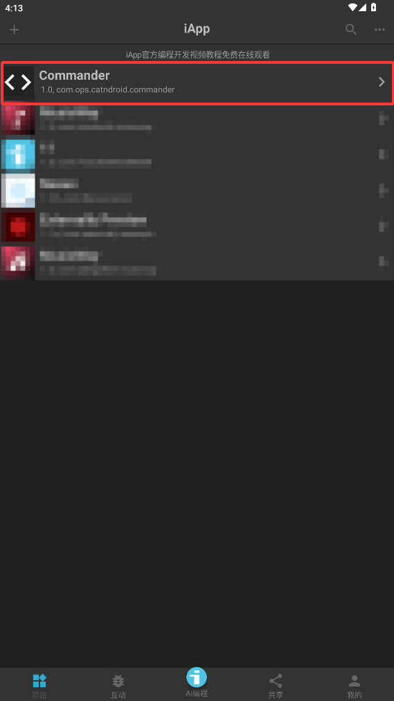
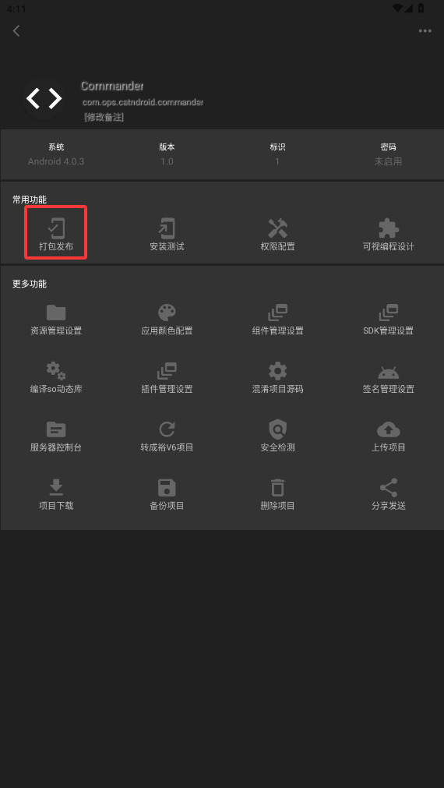

# Commander

一個簡單的 Android Shell 命令執行器
使用 **iApp v3** 編寫
> 可能存在一些問題

為了日常使用，建議**自行編譯**，而不是直接使用 Release 頁面提供的預編譯 APK；請參閱「如何打包」部分。

## 如何打包（編譯）
打包環境需求：__iApp V3.0.1039__
特別注意！你的 iApp 是否包含 Material 函式庫？ （適用於尚未升級的情況）

從 Release 頁面下載 Commander .iApp 專案檔案（非二進位 APK），然後透過系統的「分享」功能匯入 iApp。

  

點擊 Commander 項目以查看詳情。

  

然後點擊「打包發布」即可自動編譯並安裝。

## 現狀
1. 已實作 Shell 指令執行功能。
2. 具備基本的輸入功能。
3. 支援 Android SDK。
4. 語言支援：繁體中文。

## 展望
1. 支援更多語言：如簡體中文、英文、俄文等。
2. 對接 Shizuku，透過 ADB 與系統進行更多互動。
3. 修復一些佈局問題。

## 致謝
XiaoMozi
Lunox
肖珞茜 (呆毛)
Yanshan 燕山